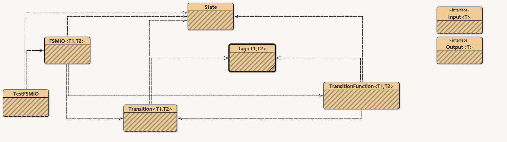
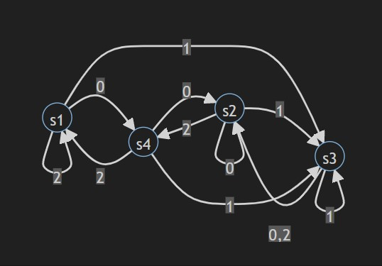
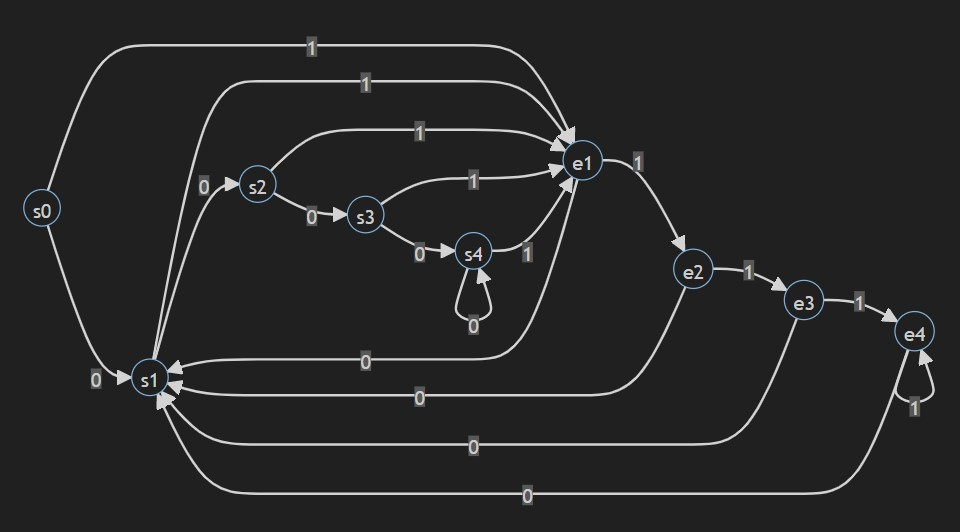

# TP4 de CS312 - Java & POO - 2021-2022 - V2

_authors_
DA COSTA Julien & CHOGNOT Gabin

# Howto

* Compiler+Exécuter avec `make`
* Retirer les .class avec `make clean`

# Not implemented

* None

# Known bugs

* Pas de bug connu.

# Questions

* 1) Que valaient T1 et T2  dans la V1 ? 

        T1 était de type char (a ou b) et T2 était de type Integer (0 ou 1)

* 2) Faire un diagramme de classe du code fourni.

        Voici le diagramme du projet :

        

# Annexes
Schéma de l'automate **fsm2** : 

Diagramme du chronogramme de **fsm3** :  