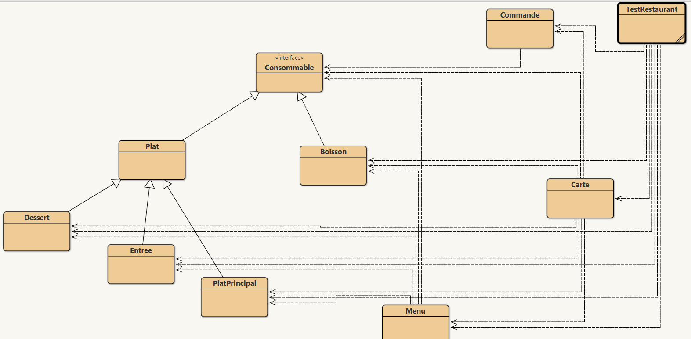

# TP3 de CS312 - Java & POO - 2022-2023

*Authors : Gabin Chognot, Julien Da Costa*

# Howto

* Compiler avec `javac Restaurant/*.java`
* Exécuter avec `java Restaurant.testRestaurant`

# Not implemented

RAS

# Known bugs

RAS

# Diagramme de classes

