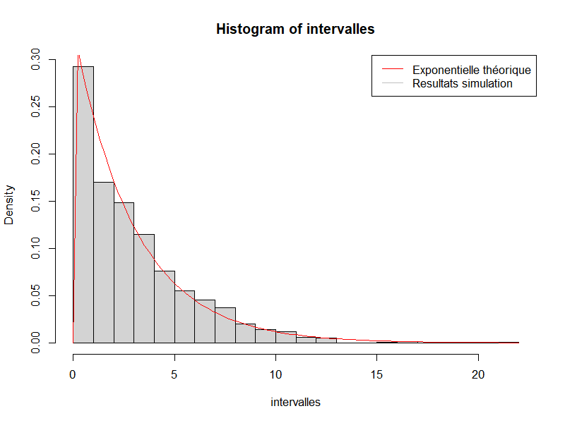
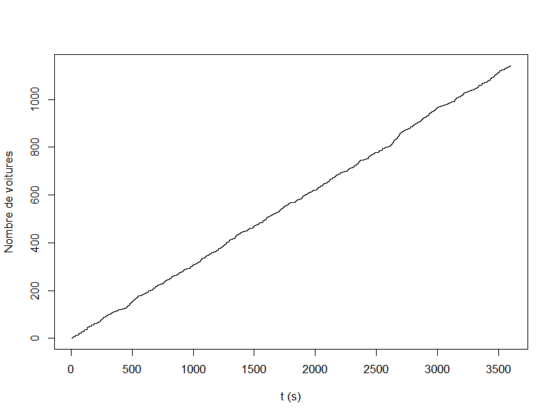
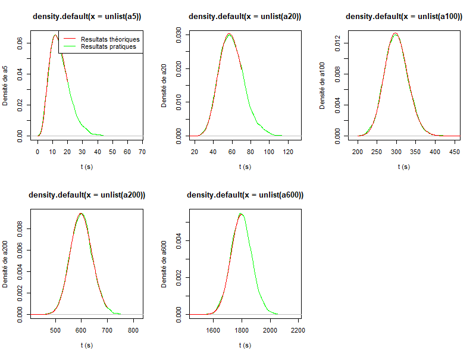
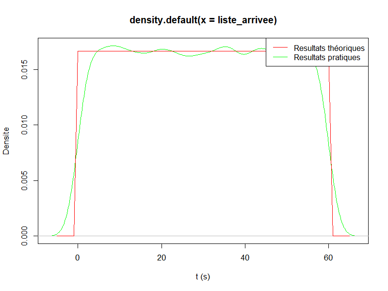
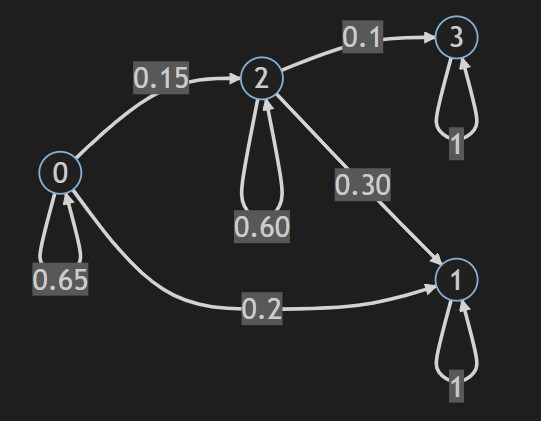
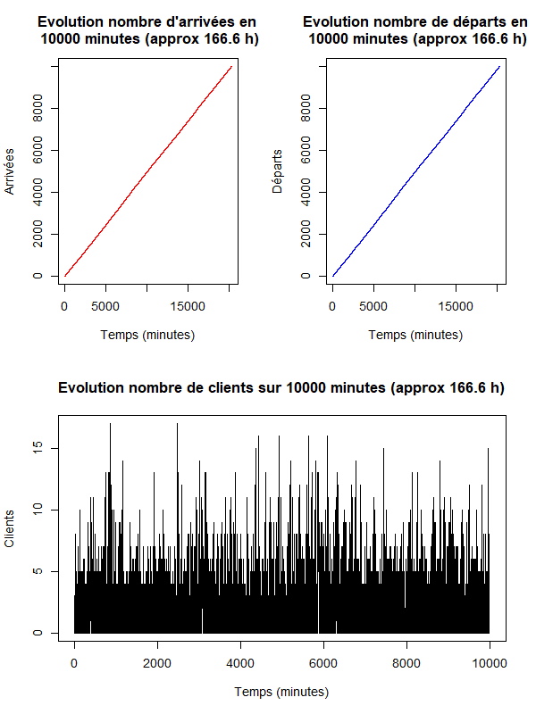

# DM de MA332

> Auteurs :
> * Gabin Chognot
> * Julien Da Costa

## Sommaire

- [DM de MA332](#dm-de-ma332)
  - [Sommaire](#sommaire)
  - [Code](#code)
  - [Readme](#readme)
- [Processus de Poisson](#processus-de-poisson)
  - [1 - Distribution exponentielle des intervalles inter-arrivées](#1---distribution-exponentielle-des-intervalles-inter-arrivées)
  - [2 - Nombre moyen d'arrivées](#2---nombre-moyen-darrivées)
  - [3 - Distribution uniforme](#3---distribution-uniforme)
- [Chaînes de Markov à temps discret](#chaînes-de-markov-à-temps-discret)
  - [1 - Modélisation de la chaîne de Markov](#1---modélisation-de-la-chaîne-de-markov)
  - [2 - Proportion de chaque état](#2---proportion-de-chaque-état)
    - [Calcul théorique](#calcul-théorique)
    - [Resultats pratiques](#resultats-pratiques)
  - [3 - Temps de mort ou de vaccination](#3---temps-de-mort-ou-de-vaccination)
    - [Calcul théorique](#calcul-théorique-1)
    - [Resultats pratiques](#resultats-pratiques-1)
  - [4 - Probabilité de mort d'une personne saine](#4---probabilité-de-mort-dune-personne-saine)
    - [Calcul théorique](#calcul-théorique-2)
    - [Resultats pratiques](#resultats-pratiques-2)
- [Files d'attente](#files-dattente)
  - [Limites](#limites)
  - [File M/M/1](#file-mm1)


## Code


Pour simuler les resultats liés à :
* L'exercice 1, exécuter le fichier `poisson.R`.
* L'exercice 2, exécuter le fichier `markov.R`.
* L'exercice 3, exécuter le fichier `file.R`.

Les codes sont commentés et les résultats sont affichés dans la console.

## Readme

Ce Readme est rédigé en Markdown, mais contient des éléments Latex, il est donc conseillé d'ouvrir la version PDF pour une meilleure lisibilité.

<div style="page-break-after: always;"></div>

# Processus de Poisson

## 1 - Distribution exponentielle des intervalles inter-arrivées

```
Tracer N(t) ? (y/n) : y
Durée de la simulation (en secondes) : 3600
Tracé de N(t) écrit dans n_t.png
Lambda_pratique =  0.3319444

Tracer la distribution des intervalles entre les arrivées ? (y/n) : y
Durée de la simulation (en secondes) : 3600
Tracé de la distribution des intervalles entre les arrivées écrit dans distrib.png
```

On a bien une distribution exponentielle des intervalles inter-arrivées :



Et on peut voir le graph de N(t) :



## 2 - Nombre moyen d'arrivées

```
Tracer la distribution des intervalles entre les arrivées ? (y/n) : y

Moyenne pour t = 3600 et n = 2000 
Moyenne = 1200.89 , moyenne théorique = 1200 , difference = 0.0741117 

Moyenne pour t = 3600 et n = 2000
Moyenne = 1200.822 , moyenne théorique = 1200 , difference = 0.0684115

Moyenne pour t = 3600 et n = 10
Moyenne = 1200.7 , moyenne théorique = 1200 , difference = 0.05829933

Moyenne pour t = 720000 et n = 10
Moyenne = 240056.3 , moyenne théorique = 240000 , difference = 0.02345283 

On effectue deux fois 1000 simulations de 3600 secondes, pour une marge d'erreur de moins de 0.001%.
Puis deux fois 10 simulations de 3600 et 720 000 secondes (respectivement). La première a une marge d'erreur plus élevée de 0.08%, du fait 
du faible nombre de simulations, et la deuxième de 0.0009%, proche des deux premières car plus longue (3600 x 2000 = 720 000 x 10)
```

Comme l'explique le programme on arrive avec de plus longues simulations en plus petit nombre à une marge d'erreur aussi faible qu'avec un plus grand nombre de simulations plus courtes, ce qui est logique.

## 3 - Distribution uniforme 

```
Verifier la distribution selon une loi Gamma des instants d'arrivée ? (y/n) : y

Verification de la distribution selon une loi Gamma des instants d'arrivée lorsque le nombre total d'arrivées est connu (1000).
Tracé des gamma des intervalles entre les arrivées écrit dans gamma.png

On voit que nos courbes pratiques, et les distributions théoriques sont très proches, les instants d'arrivée sont donc bien distribués selon un loi Gamma.
```



```
Verifier la distribution uniforme des instants d'arrivée ? (y/n) : y
Verification de la distribution uniforme des instants d'arrivée lorsque le nombre total d'arrivées est connu (1000).
Tracé de la densité des instants d'arrivée écrit dans uniforme.png

On voit que nos courbes pratiques, et les distributions théoriques sont très proches, les instants d'arrivée sont donc bien distribués selon une loi uniforme.
```



<div style="page-break-after: always;"></div>

# Chaînes de Markov à temps discret

## 1 - Modélisation de la chaîne de Markov

Graph de la chaîne de Markov : 



Matrice de transition :

$P = \begin{pmatrix}
  0.65 & 0.2 & 0.15 & 0 \\
  0 & 1 & 0 & 0 \\
  0 & 0.3 & 0.6 & 0.1 \\
  0 & 0 & 0 & 1
\end{pmatrix}$

## 2 - Proportion de chaque état

### Calcul théorique

A l'état initial, la population est composée de 100% de personnes saines, c'est à dire $\pi^{(0)} = [1,0,0,0]$

En théorie on a donc la matrice de transition suivante pour 5 semaines : $P^5 = \begin{pmatrix}
  0.12 & 0.70 & 0.11 & 0.06 \\
  0 & 1 & 0 & 0 \\
  0 & 0.69 & 0.08 & 0.23 \\
  0 & 0 & 0 & 1
\end{pmatrix}$

Donc l'état final est $\pi^{(5)} = \pi^{(0)}\times P^5= [0.12,0.70,0.11,0.06]$

### Resultats pratiques

```
Générer les resultats de 20 simulations pour 5 semaines et 10000 personnes ? (y/n) : y
Génération des resultats de 20 simulations pour 5 semaines et 10000 personnesNombre de :
- Personnes saines : 0.70279
- Personnes vaccinées : 0.11489
- Personnes malades : 0.06617
- Personnes mortes: 0.098945
```

## 3 - Temps de mort ou de vaccination

### Calcul théorique

On veut calculer l'espérance du temps d'entrée dans la sous-chaine $F = \{1,3\}$ en partant de l'état $i \in \{0,2\}$, c'est à dire le temps moyen pour qu'une personne soit morte ou vaccinée.

On a donc : 
$\begin{pmatrix} T_0 \\ T_2 \end{pmatrix} = \begin{pmatrix} 1 \\ 1 \end{pmatrix} + \begin{pmatrix} 0.65 & 0.15\\ 0 & 0.6 \end{pmatrix} \begin{pmatrix} T_0 \\ T_2 \end{pmatrix}$

On résout le système d'équations : 

$\begin{cases} T_0 = 1 + 0.65T_0 + 0.15T_2 \\ T_2 = 1 + 0.6T_2 \end{cases} = 
\begin{cases} T_0 = \frac{1}{0.35} + \frac{0.15}{0.35}T_2 \\ T_2 = \frac{1}{0.4} \end{cases} = 
\begin{cases} T_0 = \frac{20}{7} + \frac{3}{7}T_2 \\ T_2 = \frac{5}{2} \end{cases} =
\begin{cases} T_0 = \frac{55}{14} \\ T_2 = \frac{5}{2} \end{cases}$ 

Donc $T = \begin{pmatrix} T_0 \\ T_2 \end{pmatrix} = \begin{pmatrix} \frac{55}{14} \\ \frac{5}{2} \end{pmatrix}$

Alors l'espérance est $E(T) = \pi^{(0)} \times T = [1,0] \times \begin{pmatrix} \frac{55}{14} \\ \frac{5}{2} \end{pmatrix} = \frac{55}{14} = 3.928$ semaines

### Resultats pratiques

```
Simuler le temps moyen de mort/vaccination ? (y/n) : y
Temps moyen toutes les personnes d'une population de 10 000 personnes soient mortes ou vaccinées : 3.9176 semaines
```

On voit que le temps moyen est très proche de la valeur théorique, ce qui est logique car on a une population très grande.

## 4 - Probabilité de mort d'une personne saine

### Calcul théorique 

On veut calculer la probabilité qu'une personne saine meurt, c'est à dire la probabilité de passer de l'état 0 à l'état 3. On a la formule générale $f_{i,j} = p_{i,j} + \displaystyle\sum_{k\not= j} p_{i,k}\times f_{k,j}$

Ici, on a $f_{0,3} = p_{0,3} + p_{0,1}\times f_{1,3} + p_{0,2}\times f_{2,3} + p_{0,0}\times f_{0,3} = 0 + 0.2\times f_{1,3} + 0.15\times f_{2,3} + 0.65\times f_{0,3}$

Or : 
* $f_{1,3} = 0$ car on ne peut pas passer de l'état 1 à l'état 3.
* $f_{2,3} = p_{2,3} + p_{2,1}\times f_{1,3} + p_{2,2}\times f_{2,3} + p_{2,0}\times f_{0,3} = 0.1 + 0.3\times f_{1,3} + 0.6\times f_{2,3} + 0\times f_{0,3} = 0.1 + 0.3\times 0 + 0.6\times f_{2,3} = 0.1 + 0.6\times f_{2,3} \implies f_{2,3} = \frac{0.1}{0.4} = \frac{1}{4}$

Donc $f_{0,3} = 0.2\times 0 + 0.15\times \frac{1}{4} + 0.65\times f_{0,3} = \frac{3}{80} + 0.65\times f_{0,3} \implies f_{0,3} = \frac{3}{80\times 0.35} = \frac{3}{28} \approx 10,7\%$

### Resultats pratiques 

```
Simuler la probabilité que Robert meurt ? (y/n) : y
Probabilité que Robert meurt sur 10 000 simulations : 10.75 %
```

On voit que la probabilité est très proche de la valeur théorique, ce qui est logique car on a un grand nombre de simulations.

<div style="page-break-after: always;"></div>

# Files d'attente

## Limites

Nous n'avons pas pu implémenter les fonctionnalités permettant de calculer le nombre moyen de clients dans le système, ni représenter l'évolution des paramètres. `file.R` se borne donc à répondre à la question 1.

## File M/M/1

```
Tracer la simulation de la file pour t = 1000 ? (y/n) : y
La simulation a été tracée dans le fichier _figs/filemm1.png
```

On prend t = 1000 par confort, pour assurer que la file soit bien stable.


