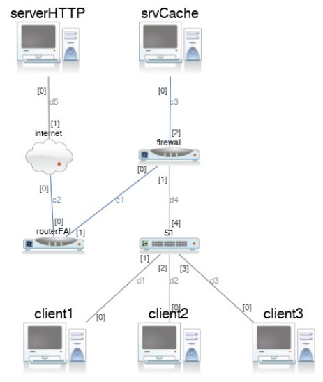

# TP2 - NAT
> Authors : Gabin Chognot & Julien Da Costa - P2025

## Table of Contents

- [TP2 - NAT](#tp2---nat)
  - [Table of Contents](#table-of-contents)
  - [Configuration de départ](#configuration-de-départ)
- [Routage](#routage)
  - [Activer le routage sur le firewall](#activer-le-routage-sur-le-firewall)
  - [Configuration des routes](#configuration-des-routes)
  - [Tests](#tests)
    - [1 - Affichage des tables](#1---affichage-des-tables)
    - [2 - Ping](#2---ping)
  - [Recap](#recap)
- [Translation d'adresse](#translation-dadresse)
  - [Masquerading](#masquerading)
  - [Translation statique](#translation-statique)
  - [Tests](#tests-1)
    - [1 - Ping depuis *client1*](#1---ping-depuis-client1)
    - [2 - Ping depuis *client2*](#2---ping-depuis-client2)
  - [Configuration de resolver](#configuration-de-resolver)
- [Filtrage](#filtrage)
  - [Créatin de la table de filtrage](#créatin-de-la-table-de-filtrage)
  - [Ajout des règles](#ajout-des-règles)
    - [ICMP :](#icmp-)
    - [HTTP et HTTPS :](#http-et-https-)
    - [DNS sortant de *srvCache* :](#dns-sortant-de-srvcache-)
    - [DNS entrant vers *srvCache* depuis les clients :](#dns-entrant-vers-srvcache-depuis-les-clients-)
  - [Conclusions](#conclusions)

## Configuration de départ

Le FAI fournit :
* Le routeur R1 configuré
* La plage d'IP `193.23.23.0/24` privée (au sein de son réseau)
  * `.253` : routeur
  * `.254` : multicast

En interne on a :
* Le réseau des clients `192.168.100.0/24`
  * `.1` : client1
  * `.2` : client2
  * `.3` : client3
* La DMZ (serveur cache DNS): `192.168.110.1/24`

Le firewall fait l'interface entre le réseau du FAI, la DMZ, et le réseau privé. Ses 3 interfaces sont entre `.254` :
* `192.168.100.254` côté clients
* `192.168.110.254` côté DMZ
* `193.23.23.254` côté FAI



<div style="page-break-after: always;"></div>

# Routage

> Objectifs :
> * Activer le routage sur le firewall si il est inactif
> * Indiquer la route par défaut pour les clients, pour le firewall et le srvCache et les configurer sur les clients


## Activer le routage sur le firewall

Le dossier `/proc/sys/` contient les paramètres de configuration du noyau pour. On vérifie que le routage est activé :
```
cat /proc/sys/net/ipv4/ip_forward
1
```
Le routage est bien activé. Si ce n'était pas le cas, on aurait obtenu `0`. 

On peut également vérifier avec `sysctl` :
```
sysctl net.ipv4.ip_forward
net.ipv4.ip_forward = 1
```

## Configuration des routes 

On configure les routes par défaut sur les clients, le firewall et le serveur cache DNS :

* *client1* : `route add default gw 192.168.100.254`
  * Pareil pour client2 et client3
* *srvCache* : `route add default gw 192.168.110.254`
* *Firewall* : `route add default gw 193.23.23.253`
* *serverHTTP* : `route add default gw 195.25.25.253`

## Tests

### 1 - Affichage des tables

On vérifie que les routes sont bien configurées avec `route -n` (`-n` permet d'afficher les adresses IP plutôt que les noms de domaine) :

```
root@client1:~# route -n
Kernel IP routing table
Destination     Gateway         Genmask         Flags Metric Ref    Use Iface
0.0.0.0         192.168.100.254 0.0.0.0         UG    0      0        0 eth0
192.168.100.0   0.0.0.0         255.255.255.0   U     0      0        0 eth0
```
On a également les bonnes routes par défaut sur *srvCache*, *Firewall*, *client2*, et *client3*.

### 2 - Ping

Egalement peut bien ping *client1* depuis *srvCache* :
```
root@srvCache:~# ping 192.168.100.1 -c 1
PING 192.168.100.1 (192.168.100.1) 56(84) bytes of data.
64 bytes from 192.168.100.1: icmp_seq=1 ttl=63 time=3.06 ms

--- 192.168.100.1 ping statistics ---
1 packets transmitted, 1 received, 0% packet loss, time 0ms
rtt min/avg/max/mdev = 3.056/3.056/3.056/0.000 ms
```
Les pings depuis et vers *client2* et *client3* fonctionnent aussi.

> On ne peut pour le moment pas ping *srvHTTP* car on n'a pas configuré la translation d'adresse.

## Recap

Actuellement, nous avons seulement configuré le routage entre le réseau client, la DMZ et en direction d'Internet. Mais sans translation d'adresse, on ne peut pas communiquer avec le FAI. Notre configuration de routage est conforme à l'attendu à cette étape.

<div style="page-break-after: always;"></div>

# Translation d'adresse

> Objectifs :
> * Translater *client1* et *client3* vers l'internet via l'IP publique du firewall (masquerading).
> * *client2* doit être différencié vis-à-vis des serveurs web. Faire la translation d'adresse statique via l’adresse source 193.23.23.2.
>
> Voir [nft tables wiki - Performing Network Address Translation (NAT)](https://wiki.nftables.org/wiki-nftables/index.php/Performing_Network_Address_Translation_(NAT))

## Masquerading

On crée une table `nat` pour la translation d'adresse :
```
root@firewall:~# nft add table nat
```

Puis on ajoute une chaîne `postrouting` à cette table :
```
root@firewall:~# nft 'add chain nat postrouting { type nat hook postrouting priority 100 ; }'
```

On a maintenant notre structure de base à laquelle on peut ajouter nos règles de translation d'adresse. On peut activer le masquerading sur le firewall :
```
root@firewall:~# nft add rule nat postrouting ip saddr {192.168.100.1,192.168.100.3} oif eth0 masquerade
```
Explications :
* `nft` : commande pour configurer netfilter
* `add rule nat postrouting` : ajout d'une règle de translation d'adresse sortante (à l'opposé de la table `prerouting` qui s'applique aux paquets entrants)
* `ip saddr {192.168.100.1,192.168.100.3}` : specifier quelles ip doivent être concernées par le masquerading (client1 et client3)
* `oif eth0` : spécification de l'interface de sortie (eth0)
* `masquerade` : type de translation d'adresse (masquerading)

On vérifie que le masquerading est bien activé :

```
root@firewall:~# nft list ruleset
table ip nat {
        chain postrouting {
                type nat hook postrouting priority srcnat; policy accept;
                ip saddr { 192.168.100.1, 192.168.100.3 } oif "eth0" masquerade
        }
}
```
Si aucune règle n'était définie, la commande n'aurait rien renvoyé.

**En résumé :**
* Avec `add table` on crée une table destinée à contenir les règles (un tableau vide)
* Avec `add chain` on crée une chaîne dans la table (une ligne dans notre tableau) qui contiendra un set de règles
* Avec `add rule` on ajoute une règle à la chaîne (une case dans notre ligne)

> Note : si besoin, on peut supprimer une table avec `nft delete table <table>`

## Translation statique

On ajoute une règle de translation statique pour *client2* qui attribut l'IP publique `193.23.23.2` à *client2* :
```
nft add rule nat postrouting ip saddr 192.168.100.2 oif eth0 snat to 193.23.23.2
```
Explications : `snat to 193.23.23.2` : spécifie l'IP publique à attribuer à *client2*

On vérifie que la règle est bien appliquée, on voit que la règle s'est bien rajoutée à la table `nat` :
```
root@firewall:~# nft list ruleset
table ip nat {
        chain postrouting {
                type nat hook postrouting priority srcnat; policy accept;
                ip saddr { 192.168.100.1, 192.168.100.3 } oif "eth0" masquerade
                ip saddr 192.168.100.2 oif "eth0" snat to 193.23.23.2
        }
}
```

Cependant on ne peut toujours pas ping *serverHTTP* depuis *client2*. Avec `tcpdump` on voit que *firewall* ne reçoit pas de réponse à ses ``who-has`` : il s'agit d'un problème de couche 2. En

Pour résoudre ce problème, on active le forwarding sur notre firewall (c'est du proxy ARP) :
```
root@firewall:~# echo 1 > /proc/sys/net/ipv4/conf/eth0/proxy_arp
```

Et on ajoute une route pour rediriger l'IP statique de *client2* vers le réseau client :
```
root@firewall: ip route add 193.23.23.2 dev eth1
```

## Tests

### 1 - Ping depuis *client1*

On vérifie que le masquerading fonctionne bien en faisant un ping depuis *client1* vers *serverHTTP* :
```
root@client1:~# ping 195.25.25.1 -c1
PING 195.25.25.1 (195.25.25.1) 56(84) bytes of data.
64 bytes from 195.25.25.1: icmp_seq=1 ttl=62 time=4.54 ms

--- 195.25.25.1 ping statistics ---
1 packets transmitted, 1 received, 0% packet loss, time 0ms
rtt min/avg/max/mdev = 4.538/4.538/4.538/0.000 ms
```
Le ping fonctionne. Si on voulait ping un domaine on devrait ajouter une config DNS, on se contente donc de ping une IP.

On peut vérifier sur le firewall fonctionne en écoutant la requête ping sur ses interfaces `eth0` et `eth1` :

```
root@firewall:/tmp# tcpdump -i eth0
listening on eth0, link-type EN10MB (Ethernet), capture size 262144 bytes
08:48:46.432002 IP 193.23.23.254 > 195.25.25.1: ICMP echo request, id 1877, seq 1, length 64
08:48:46.434520 IP 195.25.25.1 > 193.23.23.254: ICMP echo reply, id 1877, seq 1, length 64

root@firewall:/tmp# tcpdump -i eth1
listening on eth1, link-type EN10MB (Ethernet), capture size 262144 bytes
08:49:09.841023 IP 192.168.100.1 > 195.25.25.1: ICMP echo request, id 1878, seq 1, length 64
08:49:09.843080 IP 195.25.25.1 > 192.168.100.1: ICMP echo reply, id 1878, seq 1, length 64
```

On voit que *firewall* reçoit une requête de *client1* destinée à *serverHTTP*, et qu'il envoie cette requête à *serverHTTP* avec son adresse publique. Puis qu'il reçoit la réponse de *serverHTTP* destinée à son adresse publique, et qu'il la renvoie à *client1*.

On a effectue les mêmes tests sur *client3*, qui sont aussi valides.

### 2 - Ping depuis *client2*

On effectue les mêmes tests que précédemment, mais cette fois depuis *client2* :

```
root@client2:~# ping 195.25.25.1 -c 1
PING 195.25.25.1 (195.25.25.1) 56(84) bytes of data.
64 bytes from 195.25.25.1: icmp_seq=1 ttl=62 time=4.00 ms
```

Le ping est bien transmis, on n'affiche pas les résultats de `tcpdump` car ils sont identiques à ceux de la section précédente.

## Configuration de resolver 

Pour ping `www.monsite.fr` et `www.mysite.fr`, on doit d'abord configurer le resolver sur les 3 clients pour qu'ils utilisent le serveur DNS *srvCache*.


On modifie le fichier `/etc/resolv.conf` sur les trois clients, en ajoutant l'IP de *srvCache* :
```
nameserver 192.168.110.1
```
On peut maintenant `ping www.monserveur.fr` et `ping www.mysite.fr` depuis les clients :

```
root@client1:~# ping www.mysite.fr -c1
PING www.mysite.fr (195.25.25.1) 56(84) bytes of data.
64 bytes from 195.25.25.1: icmp_seq=1 ttl=62 time=4.13 ms

--- www.mysite.fr ping statistics ---
1 packets transmitted, 1 received, 0% packet loss, time 0ms
rtt min/avg/max/mdev = 4.130/4.130/4.130/0.000 ms

root@client1:~# ping www.monsite.fr -c1
PING www.monsite.fr (195.25.25.1) 56(84) bytes of data.
64 bytes from 195.25.25.1: icmp_seq=1 ttl=62 time=3.73 ms

--- www.monsite.fr ping statistics ---
1 packets transmitted, 1 received, 0% packet loss, time 0ms
rtt min/avg/max/mdev = 3.727/3.727/3.727/0.000 ms
```

<div style="page-break-after: always;"></div>

# Filtrage

## Créatin de la table de filtrage

On veut filtrer selon la politique suivante :
| Source     | Destination | Protocole  | Action    |
|------------|-------------|------------|-----------|
| Any client | Exterieur   | HTTP,HTTPS | Authorize |
| Any        | Any         | ICMP       | Authorize |
| srvCache   | Exterieur   | DNS        | Authorize |
| Any client | srvCache    | DNS        | Authorize |

On crée la table de filtrage et la chaine de filtrage sur le firewall :
```
root@firewall: nft add table ip filter

root@firewall: nft 'add chain ip filter forward { type filter hook forward priority; policy drop;}';

root@firewall: nft insert rule ip filter goout ct state established counter accept
```
*Note : `insert` sans paramètre de position agit comme `add`.*

Actuellement, on ne peut plus ping *srvHTTP* depuis le réseau client, et inversement, on doit ajouter des règles spécifiques.

## Ajout des règles

On ajoute les règles avec la commande type `nft add rule ip filter forward`

### ICMP :
```
root@firewall: nft add rule ip filter forward ip protocol icmp accept
```
Explications :
* `ip protocol icmp` - on filtre sur le protocole icmp
* `accept` - on accepte le paquet

Les pings vers *srvHTTP* et *srvCache* fonctionnent maintenant.

### HTTP et HTTPS :
```
root@firewall: nft add rule ip filter forward ip saddr { 192.168.100.1, 192.168.100.2, 192.168.100.3 } tcp dport { http, https } accept
```
Explications :
* `tcp` - on filtre sur le protocole tcp
* `dport { http, https }` - on filtre sur les ports http et https (80 et 443)

On ne peut pour l'instant pas `curl www.monsite.fr` depuis les clients. On reçoit une erreur `could not resolve host`, car on n'a pas autorisé les requêtes DNS.

### DNS sortant de *srvCache* :
```
root@firewall: nft add rule ip filter forward ip saddr 192.168.110.1 udp dport domain accept

root@firewall: nft add rule ip filter forward ip saddr 192.168.110.1 tcp dport domain accept
```
On accepte UDP et TCP car le DNS utilise UDP par défaut, sauf si les requêtes sont trop longues, auquel cas il utilise TCP.

### DNS entrant vers *srvCache* depuis les clients :

```
root@firewall: nft add rule ip filter forward ip saddr { 192.168.100.1, 192.168.100.2, 192.168.100.3 } udp dport domain ip daddr 192.168.110.1 accept

root@firewall: nft add rule ip filter forward ip saddr { 192.168.100.1, 192.168.100.2, 192.168.100.3 } tcp dport domain ip daddr 192.168.110.1 accept
``` 

On peut maintenant `curl www.monsite.fr` et `curl mysite.com` depuis les clients :
  
```
root@client1:~# curl www.monsite.fr
<?xml version="1.0" encoding="iso-8859-1"?>
<!DOCTYPE html PUBLIC "-//W3C//DTD XHTML 1.0 Transitional//EN"
         "http://www.w3.org/TR/xhtml1/DTD/xhtml1-transitional.dtd">
<html xmlns="http://www.w3.org/1999/xhtml" xml:lang="en" lang="en">
 <head>
  <title>403 Forbidden</title>
 </head>
 <body>
  <h1>403 Forbidden</h1>
 </body>
</html>
``` 

## Conclusions

Ici, on réalise du filtrage applicatif, c'est à dire que le firewall doit connaitre les ports, c'est donc un filtrage de couche 7.

> On ne peut pas effectuer les tests sur `www.monfakesite.fr`, car la zone DNS n'est pas configurée pour ce domaine.

